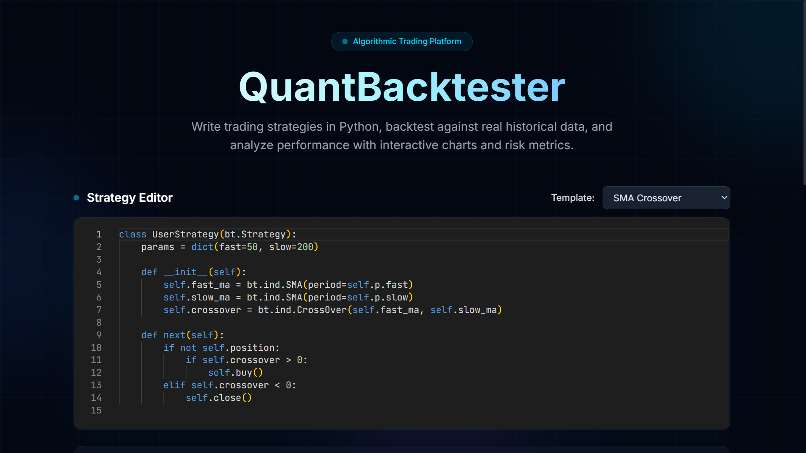
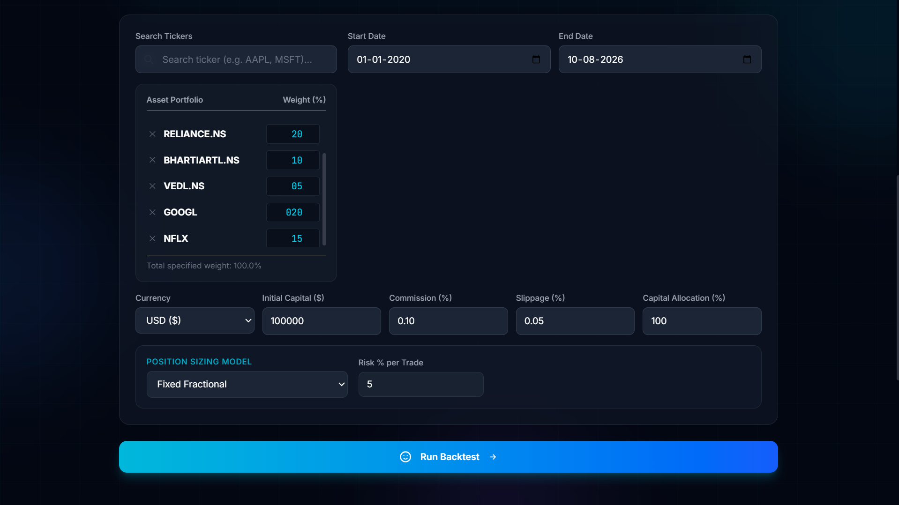

# QuantBacktester

[](LICENSE)
[](https://python.org)
[](https://nextjs.org)



---

## Quick Start

```bash
# 1. Clone the repository
git clone https://github.com/youruser/quantbacktester.git
cd quantbacktester

# 2. Copy environment variables
cp .env.example .env

# 3. Launch all services
docker compose up --build

# 4. Open in browser
open http://localhost:3000
```

The platform will be available at `http://localhost:3000` with the API at `http://localhost:8000`.

---

## Architecture

```
┌─────────────┐     ┌──────────────────┐     ┌──────────┐
│   Browser   │────▶│  Next.js 14      │     │          │
│  (User)     │◀────│  Frontend :3000  │     │  Redis   │
└─────────────┘     └──────────────────┘     │  :6379   │
                             │               └────┬─────┘
                             │                    │
                             ▼                    │
                    ┌──────────────────┐          │
                    │  FastAPI         │◀─────────┘
                    │  Backend :8000   │
                    └────┬────────┬────┘
                         │        │
                         ▼        ▼
                 ┌───────────┐  ┌──────────┐
                 │PostgreSQL │  │  Celery   │
                 │  :5432    │  │  Worker   │
                 └───────────┘  └──────────┘
```

### Data Flow
1. User writes strategy in Monaco Editor → submits via REST API
2. FastAPI validates input → dispatches Celery task
3. Celery worker fetches OHLCV data (yfinance, cached in PostgreSQL)
4. Backtrader runs the strategy → extracts equity curve + trades
5. Metrics service computes Sharpe, Sortino, drawdown, etc.
6. Monte Carlo service runs 1000 simulations
7. Results stored in PostgreSQL → returned to frontend
8. Frontend renders interactive Plotly charts + metrics grid

---

## Supported Metrics

| Metric | Description |
|--------|-------------|
| **Total Return** | Cumulative portfolio gain/loss over the backtest period |
| **Annualized Return** | Compound annual growth rate (CAGR) |
| **Sharpe Ratio** | Risk-adjusted return (excess return / volatility) |
| **Sortino Ratio** | Like Sharpe, but only penalizes downside volatility |
| **Max Drawdown** | Largest peak-to-trough decline during the backtest |
| **Calmar Ratio** | Annualized return / |max drawdown| |
| **Win Rate** | Percentage of profitable trades |
| **Profit Factor** | Gross profit / gross loss |
| **Total Trades** | Number of completed round-trip trades |
| **Avg Holding Period** | Average trade duration in calendar days |

---

## Strategy DSL Reference

Strategies are written as Python classes extending `bt.Strategy` from the Backtrader library. The following are pre-imported in the sandbox:

- `bt` — Backtrader library
- `np` — NumPy
- `pd` — Pandas

### Example Strategy

```python
class UserStrategy(bt.Strategy):
    params = dict(fast=50, slow=200)

    def __init__(self):
        self.fast_ma = bt.ind.SMA(period=self.p.fast)
        self.slow_ma = bt.ind.SMA(period=self.p.slow)
        self.crossover = bt.ind.CrossOver(self.fast_ma, self.slow_ma)

    def next(self):
        if not self.position:
            if self.crossover > 0:
                self.buy()
        elif self.crossover < 0:
            self.close()
```

### Key Methods
- `__init__()` — Define indicators
- `next()` — Called on each bar; implement trading logic
- `self.buy()` / `self.sell()` / `self.close()` — Execute orders
- `self.position` — Current position info of the first data feed
- `self.getposition(data)` — Current position info of a specific data feed
- `self.data.close[0]` — Current close price of the first data feed
- `data.close[0]` — Current close price of a specific data feed

### Multi-Asset Strategy Logic

For multi-asset portfolio backtesting, you can select multiple tickers in the backtest configuration form. The data feeds will be added to the strategy and can be accessed via:

* `self.datas` — A list of all data feeds loaded in the system.
* `self.datas[i]` — Access individual data feeds.
* `self.getdatabyname(name)` — Retrieve a data feed by its ticker symbol (e.g., `self.getdatabyname('AAPL')`).
* Loop through all data feeds to perform portfolio-wide checks or rebalancing:

```python
class MultiAssetRebalance(bt.Strategy):
    def __init__(self):
        # Create indicators for each loaded asset
        self.mas = {d: bt.ind.SMA(d, period=50) for d in self.datas}

    def next(self):
        for data in self.datas:
            pos = self.getposition(data).size
            ma = self.mas[data][0]
            close = data.close[0]
            
            if not pos and close > ma:
                # Buy order sized automatically based on the asset's weight
                self.buy(data=data)
            elif pos > 0 and close < ma:
                self.close(data=data)
```

> [!NOTE]
> When executing orders in a multi-asset strategy, you must specify the `data` parameter (e.g. `self.buy(data=data)`). If omitted, Backtrader defaults to trading the first asset (`self.datas[0]`).

---

## Position Sizing Models

The project supports pluggable position sizing models that determine the share size of execution orders based on account equity, asset volatility, or historical trade metrics:

### 1. All-in (Default)
Sizes orders based on a simple percentage allocation of currently available cash scaled by the asset's portfolio weight:
\[\text{Size} = \frac{\text{Cash} \times \text{Allocation} \times \text{Asset Weight}}{\text{Price}}\]

### 2. Fixed Fractional
Risks a fixed percentage of total portfolio equity on each trade:
\[\text{Size} = \frac{\text{Equity} \times \text{Risk \%} \times \text{Asset Weight}}{\text{Price}}\]
- **Parameters**:
  - `risk_pct` — The maximum percentage of total equity risked on a trade (default: `2.0%`).

### 3. Volatility-Targeted
Scales the position size inversely to the asset's recent Average True Range (ATR). Higher-volatility assets get smaller position sizes, leveling risk across products:
\[\text{Size} = \frac{\text{Equity} \times \text{Target Risk \%} \times \text{Asset Weight}}{\text{ATR}(\text{period})}\]
- **Parameters**:
  - `target_risk_pct` — Target portfolio risk percentage (default: `1.0%`).
  - `atr_period` — Lookback period for Average True Range calculation (default: `14` days).

### 4. Kelly Criterion
Sizes positions dynamically using the Kelly Criterion formula based on the trailing win rate and win-loss ratio of the strategy's completed trades:
\[\text{Kelly \%} = \text{Win Rate} - \frac{1 - \text{Win Rate}}{\text{Win-Loss Ratio}}\]
\[\text{Size} = \frac{\text{Equity} \times \max(0, \text{Kelly \%} \times \text{Multiplier}) \times \text{Asset Weight}}{\text{Price}}\]
- **Parameters**:
  - `kelly_multiplier` — Kelly fraction scale (e.g., `0.5` for Half-Kelly, default: `0.5`).
  - `max_fraction` — Hard cap on equity allocation to prevent over-leveraging (default: `20.0%`).
  - `default_win_rate` — Fallback win rate if no trailing trades exist (default: `0.50`).
  - `default_win_loss` — Fallback win-loss ratio if no trailing trades exist (default: `1.5`).

---

## Realistic Execution Modeling

The backtest engine simulates several real-world trading constraints and frictional costs to prevent overoptimistic performance:

### 1. Slippage Models
Adjusts order execution prices to simulate market impact or low liquidity:
- **Percentage Slippage**: Slippage is a percentage of the execution price.
  \[\text{Buy Price} = P \times (1 + \text{Slippage \%})\]
  \[\text{Sell Price} = P \times (1 - \text{Slippage \%})\]
- **Points/Ticks Slippage**: Slippage adds/subtracts a fixed point amount from the price:
  \[\text{Buy Price} = P + \text{Slippage Points}\]
  \[\text{Sell Price} = P - \text{Slippage Points}\]

### 2. Commission Structures
Calculates transaction costs using different pricing models:
- **Percentage Commission (Default)**: A percentage of total transaction value (e.g. 0.1%):
  \[\text{Commission} = \text{Size} \times \text{Price} \times \text{Rate}\]
- **Per-Share / Per-Contract**: A flat fee per share traded (e.g. $0.005/share):
  \[\text{Commission} = \text{Size} \times \text{Rate}\]
- **Tiered Per-Share**: A discounted rate for larger order sizes (e.g., $0.005/share for first 1,000 shares, and $0.003/share for any shares above):
  \[\text{Commission} = \min(\text{Size}, \text{Limit}) \times \text{Base Rate} + \max(0, \text{Size} - \text{Limit}) \times \text{Tier Rate}\]

### 3. Bid-Ask Spread Simulation
Models the bid-ask spread on daily bar prices:
- Executions simulate buying at the **ask** price and selling at the **bid** price by adding/subtracting half of the spread:
  \[\text{Execution Price Adjustment} = \text{Slippage} + \frac{\text{Spread}}{2}\]

### 4. Volume-Based Fill Limits (Partial Fills)
Restricts the maximum number of shares filled on any single bar based on liquidity limits:
- Maximum shares filled per bar is capped at a configurable percentage of the bar's volume (e.g., maximum 10% of volume). Any unfilled remainder of the order stays active in the market to be filled on subsequent bars:
  \[\text{Max Fill Size} = \text{Bar Volume} \times \text{Volume Limit \%}\]

---

## Built-in Strategy Templates

| Strategy | Description |
|----------|-------------|
| **SMA Crossover** | Buy when 50-day SMA crosses above 200-day SMA |
| **EMA Crossover (3/30)** | Buy when 3-period EMA crosses above 30-period EMA |
| **RSI Mean Reversion** | Buy when RSI(14) < 30, sell when > 70 |
| **Bollinger Bands** | Buy below lower band, sell above upper band |
| **MACD** | Buy on MACD/signal line bullish crossover |

---

## Tech Stack

### Backend
- FastAPI, Backtrader, yfinance, pandas, numpy, scipy
- Celery + Redis for async task processing
- PostgreSQL + SQLAlchemy for data persistence
- Pydantic v2 for validation

### Frontend
- Next.js 14 (App Router), TypeScript
- Monaco Editor (in-browser code editor)
- Plotly.js (interactive charts)
- TailwindCSS (styling)
- Zustand (state management)
- TanStack Query (data fetching)

---

## Contributing

1. Fork the repository
2. Create a feature branch (`git checkout -b feature/amazing-feature`)
3. Commit your changes (`git commit -m 'Add amazing feature'`)
4. Push to the branch (`git push origin feature/amazing-feature`)
5. Open a Pull Request

---

## License

Distributed under the MIT License. See `LICENSE` for more information.

---

## Walk-Forward Optimization & Parameter Sweeps (Phase 4)




### Overview

Phase 4 adds two optimization modes that help identify robust trading strategies and detect over-fitting:

| Mode | Description |
|------|-------------|
| **Parameter Sweep** | Grid search across all combinations of strategy parameters |
| **Walk-Forward Analysis** | Rolling in-sample/out-of-sample evaluation to test generalization |

---

### Parameter Sweep

Runs every combination of candidate values from a user-specified grid and reports the metric (Sharpe Ratio by default) for each.

**How to use:**
1. Select **Parameter Sweep** in the Optimization Mode panel on the main page.
2. Fill in comma-separated candidate values for each strategy parameter detected from your code.
   - Example: for `params = dict(fast=50, slow=200)`, enter `fast: 3, 5, 10` and `slow: 20, 30, 50`.
3. Choose an **objective metric** (e.g. Sharpe Ratio, Total Return, Sortino Ratio).
4. Click **Run Parameter Sweep**.

**Results:**
- A 2D colour heatmap (when 2 parameters are specified) mapping objective metric across the grid.
- A ranked table of all combinations sorted by the selected metric.
- Highlighted **best parameter** combination.

**API:**
```http
POST /api/backtest/sweep
{
  "strategy_code": "...",
  "tickers": ["AAPL"],
  "start_date": "2020-01-01",
  "end_date": "2024-01-01",
  "param_grid": {"fast": [3, 5, 10], "slow": [20, 30, 50]},
  "config": {...},
  "objective": "sharpe_ratio"
}
```

```http
GET /api/backtest/{task_id}/sweep
```

---

### Walk-Forward Analysis (WFA)

Splits the full date range into rolling or expanding in-sample (training) and out-of-sample (testing) windows. For each window:
1. An in-sample parameter sweep finds the best parameters.
2. The best parameters are evaluated on the subsequent out-of-sample period (no re-fitting).
3. Out-of-sample equity curves are concatenated into a continuous aggregate curve.

#### WFA Window Types
- **Rolling Window (Default):** Fixed-length sliding IS and OOS periods. Both shift forward by the OOS length each fold.
- **Rolling Window (Anchored):** Pinned IS start date (the first fold's IS start) so the training window grows with each fold, while the OOS period slides forward.
- **Expanding Window:** The IS start is pinned to the beginning of the entire backtest range, growing in size per fold, followed by the fixed-length OOS period.

#### Advanced WFA Diagnostics
- **Walk-Forward Efficiency Ratio (WFER):** Ratio of $\text{OOS Metric} / \text{IS Metric}$. CONSISTENTLY below 0.5 signals overfitting. A mean ratio $\ge 0.7$ suggests high generalizability.
- **Parameter Stability (CV):** Calculates the Coefficient of Variation ($CV = \sigma / \mu$) for each numeric parameter across folds. A high CV indicates parameter selections are unstable and sensitive to minor data shifts.
- **Pre-Flight Run Estimator:** Light-weight arithmetic validator that calculates folds, parameter combinations, and total backtests. Submissions exceeding the defined cap (e.g. 200 runs) are rejected before execution.

**How to use:**
1. Select **Walk-Forward Analysis** in the Optimization Mode panel.
2. Fill in candidate parameter values and choose an objective.
3. Set **In-Sample Days** (default: 365) and **Out-of-Sample Days** (default: 90).
4. Configure **Window Type** (Rolling / Expanding) and **Anchored** toggle.
5. Set **Max Runs Cap** limit to define the computation ceiling.
6. Click **Run Walk-Forward Analysis** (disabled if the pre-flight estimate exceeds the cap).

**Results:**
- Color-coded aggregate **Efficiency Ratio Banner** (Green: Well-generalised, Amber: Moderate risk, Red: Overfit warning).
- Interactive **Parameter Stability CV chart** mapping parameter fluctuations.
- Per-window comparison table of IS vs. OOS metrics and fold-specific efficiency ratios.
- Continuous out-of-sample equity curve chart.

**API:**
```http
POST /api/backtest/walkforward/estimate
{
  "tickers": ["AAPL"],
  "start_date": "2018-01-01",
  "end_date": "2024-01-01",
  "param_grid": {"fast": [3, 5, 10], "slow": [20, 30, 50]},
  "in_sample_days": 365,
  "out_of_sample_days": 90,
  "window_type": "rolling",
  "anchored": false,
  "max_combinations": 200
}
```

```http
POST /api/backtest/walkforward
{
  "strategy_code": "...",
  "tickers": ["AAPL"],
  "start_date": "2018-01-01",
  "end_date": "2024-01-01",
  "param_grid": {"fast": [3, 5, 10], "slow": [20, 30, 50]},
  "in_sample_days": 365,
  "out_of_sample_days": 90,
  "objective": "sharpe_ratio",
  "window_type": "rolling",
  "anchored": false,
  "max_combinations": 200
}
```

```http
GET /api/backtest/{task_id}/walkforward
```

---

### New Database Tables

| Table | Purpose |
|-------|---------|
| `sweep_results` | One row per parameter combination per sweep task |
| `wfa_windows` | One row per rolling window per walk-forward task, including `window_type`, `anchored`, and `efficiency_ratio` |

The `backtest_results` table gains three new columns: `run_type` (`single` / `sweep` / `walk_forward`), `progress` (human-readable progress string), and `anchored` (boolean).

---

### Implementation Notes

- **Concurrency**: Sweep combinations run in parallel using `ThreadPoolExecutor` (default: 4 workers). Each window's in-sample sweep is also parallelised.
- **Progress reporting**: The `progress` field on the `backtest_results` record is updated after each combination/window completes, enabling live progress display while polling.
- **Objective**: All available objectives map to the `PerformanceMetrics` fields: `sharpe_ratio`, `total_return`, `sortino_ratio`, `calmar_ratio`, `profit_factor`.
